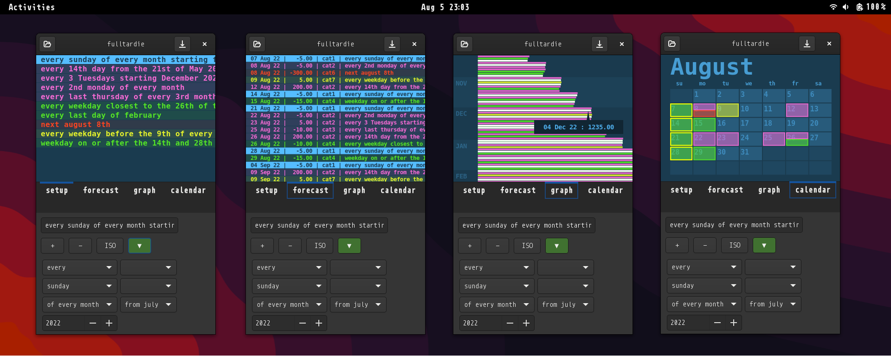

# fulltardie

forecast transactions that have complex recurrence rules

4th & current edition
- significantly faster
- 64-bit
- runs on arm devices
- compact ui for phone
- expanded forecasting capabilities

# status
- usable for its intended purpose
- lacks error handling for obvious stuff like nulls & empties
- needs a lot of work for touchscreen
- some of the ui will be re-designed

# usage (testing, linux only)
- install gtk4-devel
- install valac
- mkdir ~/Desktop/fulltardie && cd ~/Desktop/fulltardie
- wget -O fulltardie_gtk4_cairo.vala https://raw.githubusercontent.com/snotbubble/fulltardie4/main/fulltardie_gtk4_cairo.vala
- valac fulltardie_gtk4_cairo.vala --pkg gtk4 -X -lm
- ./fulltardie_gtk4_cairo

# screenie

