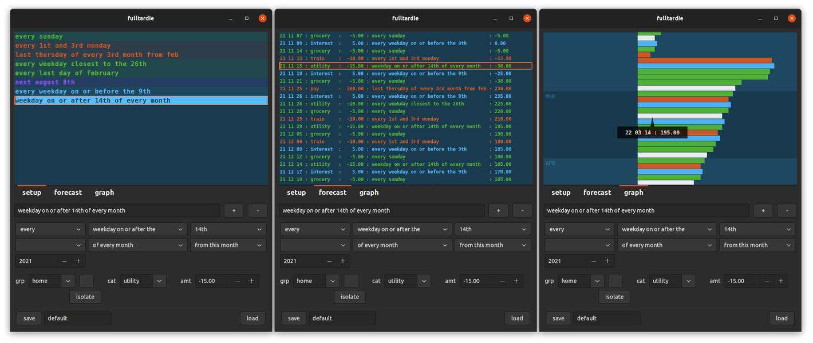

# fulltardie

forecast transactions that have complex recurrence rules

4th & current edition
- significantly faster
- 64-bit
- runs on arm devices
- compact ui for phone
- expanded forecasting capabilities

status
- usable, but no safety atm; you can segfault it without too much effort
- on the pinephone its usable at 150% display scale, 
- graph touch interaction not implemented yet, 
- param ui still needs a lot of work to make it work on a small screen (investigating gtk4)

usage (pre-release, linux only)
- mkdir ~/Desktop/fulltardie && cd ~/Desktop/fulltardie
- wget -O fulltardie.vala https://raw.githubusercontent.com/snotbubble/fulltardie4/main/fulltardie.vala
- valac fulltardie.vala --pkg gtk+-3.0 -X -lm
- ./fulltardie

# screenie

