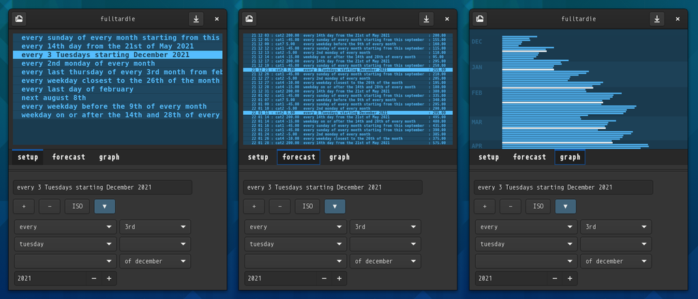

# fulltardie

forecast transactions that have complex recurrence rules

4th & current edition
- significantly faster
- 64-bit
- runs on arm devices
- compact ui for phone
- expanded forecasting capabilities

# TODO
- [ ] find cause of random startup graphics error on pinephone
- [ ] implement touch interaction with cairo drawingarea
- [ ] clearly differentiate touch events on cairo drawingarea (tap, drag, longpress, pinch)
- [ ] double-click/tap on empty space to re-fit drawingarea content
- [ ] try to get smoothly resizing fonts in cairo (investigate vulcan shader if this can't be done)
- [ ] fix paned separator touch area (its way too big compared to mouse area)
- [ ] force paned to switch to vertical if window aspect changes to widescreen
- [ ] set initial second paned child width to something optimal after switching to vertical orientation
- [ ] lock second paned child width to user-specified width (via separator drag) while in vertical orientation
- [ ] implement zoomable 3r 4c month calendar in cairo
- [ ] double-tap calendar to frame this month
- [ ] complete rule component renaming/re-arranging to make more sense in plain english
- [ ] drag-n-drop reorder of rules
- [ ] isolate category
- [ ] try to break the forecast with malicious usage and fix accordingly
- [ ] gnome notification integration for next week of transactions
- [ ] add done button to transaction notifications (notifications persist otherwise)
- [ ] add notification doubleclick to focus in fulltardie
- [ ] add layered circle graph tab (group, category)
- [ ] add highlight and info bubble to circle graph selection
- [ ] add export circle graph to png
- [ ] investigate dragging a tab into new panel (will need to replace paned)
- [ ] given the above, save layout with scenario
- [ ] given the above, consolidate layout when window size is reduced, restore layout when window size is increased again

# usage (testing, linux only)
- mkdir ~/Desktop/fulltardie && cd ~/Desktop/fulltardie
- wget -O fulltardie_gtk4_cairo.vala https://raw.githubusercontent.com/snotbubble/fulltardie4/main/fulltardie_gtk4_cairo.vala
- valac fulltardie_gtk4_cairo.vala --pkg gtk4 -X -lm
- ./fulltardie_gtk4_cairo

# screenie

